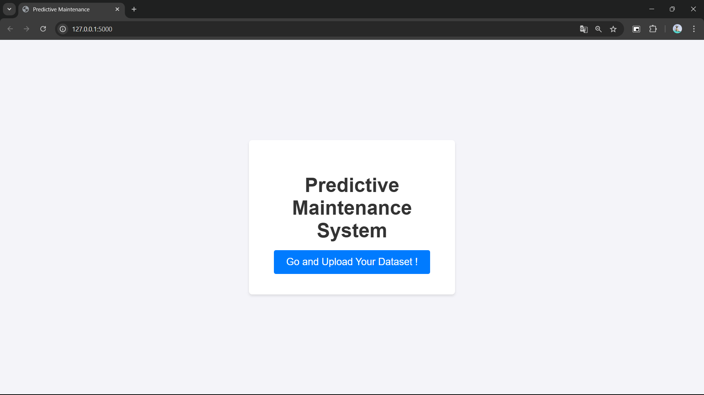
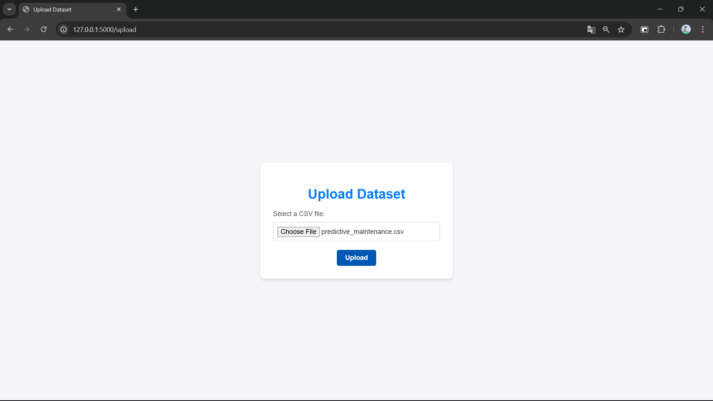
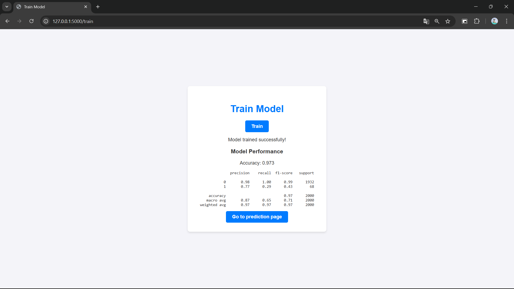
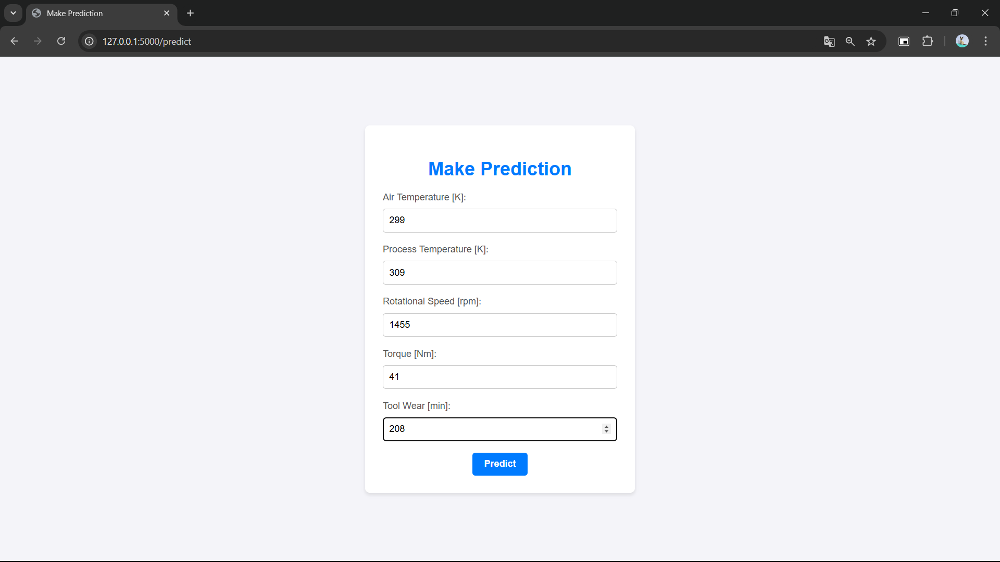

# Predictive Machine Maintenance System

A web-based Predictive Maintenance system built with Flask and machine learning techniques. The system predicts equipment failures in advance, allowing for proactive maintenance to minimize downtime and improve operational efficiency.

## Features

- **Upload Dataset**: Allows users to upload CSV files containing equipment data.
- **Train Model**: Trains a machine learning model using the uploaded dataset.
- **Make Prediction**: Predicts equipment failure based on user input, including key parameters like temperature, speed, torque, and more.

## Technologies Used

- **Flask**: A lightweight web framework for building the web application.
- **Scikit-learn**: For machine learning algorithms, including model training and predictions.
- **Pandas**: For data manipulation and preprocessing.
- **HTML/CSS**: For building the user interface.

## Screenshots

Here are some screenshots of the web application:

1. **Home Page**
   - Displays the "Predictive Maintenance" heading and a button to upload the dataset.
   
   

2. **Upload Dataset Page**
   - Allows users to upload their CSV file with the equipment data.
   
   

3. **Train Model Page**
   - After uploading the dataset, users can train the machine learning model and view its performance.
   
   

4. **Prediction Page**
   - Users can input features like air temperature, rotational speed, etc., and the system will predict equipment failure.
   
   

## Getting Started

### Prerequisites

- Python 3.x
- Pip (Python package installer)

### Installation

1. Clone the repository:

    ```bash
    git clone https://github.com/your-username/predictive-maintenance.git
    cd predictive-maintenance
    ```

2. Create and activate a virtual environment:

    ```bash
    python3 -m venv venv
    source venv/bin/activate  # On Windows, use venv\Scripts\activate
    ```

3. Install the required dependencies:

    ```bash
    pip install -r requirements.txt
    ```

4. Run the application:

    ```bash
    python app.py
    ```

   The application will be accessible at `http://127.0.0.1:5000/`.

## How to Use

1. **Upload Dataset**:
    - Navigate to the "Upload Dataset" page and select a CSV file with the required equipment data. This data should include key features such as temperature, speed, torque, and tool wear.

2. **Train Model**:
    - Once the dataset is uploaded, go to the "Train Model" page to train the machine learning model using the uploaded dataset.

3. **Make Prediction**:
    - After training the model, you can input parameters such as air temperature, rotational speed, torque, and tool wear on the "Make Prediction" page to get a prediction on whether the equipment will fail.

## Folder Structure

The folder structure of the project is organized as follows:
```
PredictiveMachineMaintainance/
├── data/
│   └── predictive_maintainance.csv            # dataset
├── model/
│   └── decisiontree.pkl                       # model after getting trained
├── static/
│   └── style.css
├── templates/
│   └── index.html
│   └── predict.html  
│   └── train.html
│   └── upload.html
├── app.py                                     # Main script for detection
├── requirements.txt                           # Required dependencies
└── README.md                                  # Project documentation
```